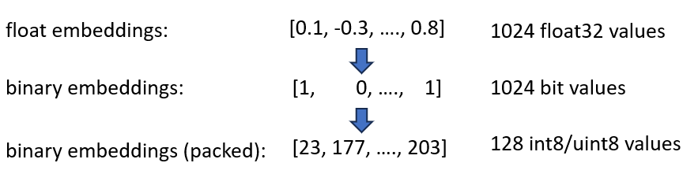
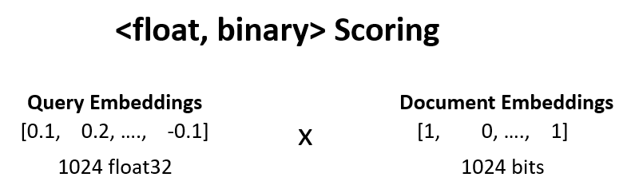
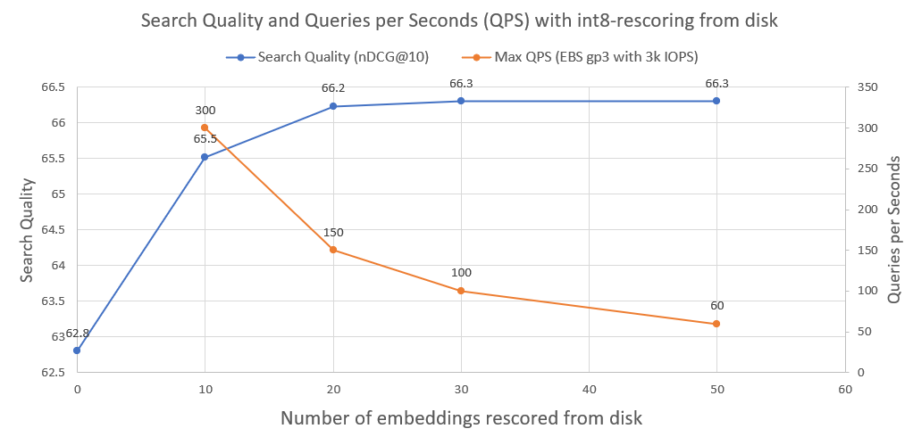

# BinaryVectorDB - Efficient Search on Large Datasets

This repository contains a Binary Vector Database for efficient search on large datasets, aimed for educational purposes.

Most embedding models represent their vectors as float32: These consume a lot of memory and search on these is very slow. At Cohere, we introduced the first embedding model with native [int8 and binary support](https://txt.cohere.com/int8-binary-embeddings/), which give you excellent search quality for a fraction of the cost:


| Model | Search Quality MIRACL | Time to Search 1M docs | Memory Needed 250M Wikipedia Embeddings | Price on AWS (x2gb instance) |
| ----- |:---------------------:|:----------------------:|:---------------------------------------:|:------------:|
| OpenAI text-embedding-3-small | 44.9 | 680 ms | 1431 GB | $65,231 / yr |
| OpenAI text-embedding-3-large | 54.9 | 1240 ms | 2861 GB | $130,463 / yr |
| **Cohere Embed v3 (Multilingual)** | | | | |
| Embed v3 - float32 | 66.3 | 460 ms | 954 GB | $43,488 / yr |
| Embed v3 - binary | 62.8 | 24 ms | 30 GB | $1,359 / yr |
| Embed v3 - binary + int8 rescore | 66.3 | 28 ms | 30 GB memory + 240 GB disk | $1,589 / yr |


# Demo

We created a demo that allows you to search on 100M Wikipedia Embeddings for a VM that costs just $15/month:
[Demo - Search on 100M Wikipedia Embeddings for just $15/mo](http://binaryvectordb.nils-reimers.de/)

# Setup

You can easily use BinaryVectorDB on your own data. 

The setup is easy:
```
pip install BinaryVectorDB
```

To use some of the below examples you need a **Cohere API key** (free or paid) from [cohere.com](https://cohere.com/). You must set this API key as an environment variable: `export COHERE_API_KEY=your_api_key`  


# Usage - Load an Existing Binary Vector Database

We will show later how to build a vector DB on your own data. For the start, let us use a **pre-build binary vector database**. We host various **pre-build databases** on [https://huggingface.co/datasets/Cohere/BinaryVectorDB](https://huggingface.co/datasets/Cohere/BinaryVectorDB). You can download these and use them localy.

Let us the simple English version from Wikipedia to get started:
```
wget https://huggingface.co/datasets/Cohere/BinaryVectorDB/resolve/main/wikipedia-2023-11-simple.zip
```

And then unzip this file:
```
unzip wikipedia-2023-11-simple.zip
```


## Load the Vector Database

You can load the database easily by pointing it to the unzipped folder from the previous step:

```python
from BinaryVectorDB import BinaryVectorDB

# Point it to the unzipped folder from the previous step
# Ensure that you have set your Cohere API key via: export COHERE_API_KEY=<<YOUR_KEY>>
db = BinaryVectorDB("wikipedia-2023-11-simple/")

query = "Who is the founder of Facebook"
print("Query:", query)
hits = db.search(query)
for hit in hits[0:3]:
    print(hit)
```

The database has 646,424 embeddings and a total size of 962 MB. However, just 80 MB for the binary embeddings are loaded in memory. The documents and their int8 embeddings are kept on disk and are just loaded when needed.

This split of binary embeddings in memory and int8 embeddings & documents on disk allows us to scale to very large datasets without need tons of memory.

# Build your own Binary Vector Database

It is quite easy to build your own Binary Vector Database.

```python
from BinaryVectorDB import BinaryVectorDB
import os
import gzip
import json

simplewiki_file = "simple-wikipedia-example.jsonl.gz"

#If file not exist, download
if not os.path.exists(simplewiki_file):
    cmd = f"wget https://huggingface.co/datasets/Cohere/BinaryVectorDB/resolve/main/simple-wikipedia-example.jsonl.gz"
    os.system(cmd)

# Create the vector DB with an empty folder
# Ensure that you have set your Cohere API key via: export COHERE_API_KEY=<<YOUR_KEY>>
db_folder = "path_to_an_empty_folder/"
db = BinaryVectorDB(db_folder)

if len(db) > 0:
    exit(f"The database {db_folder} is not empty. Please provide an empty folder to create a new database.")

# Read all docs from the jsonl.gz file
docs = []
with gzip.open(simplewiki_file) as fIn:
    for line in fIn:
        docs.append(json.loads(line))

#Limit it to 10k docs to make the next step a bit faster
docs = docs[0:10_000]

# Add all documents to the DB
# docs2text defines a function that maps our documents to a string
# This string is then embedded with the state-of-the-art Cohere embedding model
db.add_documents(doc_ids=list(range(len(docs))), docs=docs, docs2text=lambda doc: doc['title']+" "+doc['text'])
```

The document can be any Python serializable object. You need to provide a function for `docs2text` that map your document to a string. In the above example, we concatenate the title and text field. This string is send to the embedding model to produce the needed text embeddings.


## Updating & Deleting Documents

Adding / deleting / updating docs is easy. See [examples/add_update_delete.py](examples/add_update_delete.py) for an example script how to add/update/delete documents in the database.


# How does it work?

We announced our [Cohere int8 & binary Embeddings](https://txt.cohere.com/int8-binary-embeddings/) embeddings, that offer a 4x and 32x reduction in the needed memory. Further, it gives up to a 40x speed-up in vector search. 

## Step 1: Binary Embeddings in Memory
Both techniques are combined in the BinaryVectorDB. For an example, let's assume the English Wikipedia with 42M embeddings. Normal float32 embeddings would need `42*10^6*1024*4 = 160 GB` of memory to just host the embeddings. As search on float32 is rather slow (about 45 seconds on 42M embeddings), we need to add an index like HNSW, that adds another 20GB of memory, so you need a total of 180 GB.



Binary embeddings represents every dimension as 1 bit. This reduces the memory need to `160 GB / 32 = 5GB`. Also as search in binary space is 40x faster, you no longer need the HNSW index in many cases. You reduced your memory need from 180 GB to 5 GB, a nice 36x saving.

When we query this index, we encode the query also in binary and use hamming distance. Hamming distance measures the 1-bit differences between 2 vectors. This is an extremely fast operation: To compare two binary vectors, you just need 2-CPU cycles: `popcount(xor(vector1, vector2))`. XOR is the most fundamental operation on CPUs, hence it runs extremely quickly. `popcount` counts the number of 1 in the register, which also just needs 1 CPU cycle.

Overall, this gives us a solution that keeps about 90% of the search quality.

## Step 2: <float, binary> Rescoring

We can increase the search quality from the previous step from 90% to 95% by `<float, binary>` rescoring.

We take e.g. the top-100 results from step 1, and compute `dot_product(query_float_embedding, 2*binary_doc_embedding-1)`.

Assume our query embedding is `[0.1, -0.3, 0.4]` and our binary document embedding is `[1, 0, 1]`. This step then computes:
```
(0.1)*(1) + (-0.3)*(-1) + 0.4*(1) = 0.1 + 0.3 + 0.4 = 0.8
```



We use these scores and rescore our results. This pushes the search quality from 90% to 95%. This operation can be done extremely quickly: We get the query float embedding from the embedding model, the binary embeddings are in memory, so we just need to do 100 sum-operations.

## Step 3: <float, int8> Rescoring from Disk

To further improve the search quality, from 95% to 99.99%, we use int8 rescoring from disk.

We save all int8 document embeddings on disk. We take then the top-30 from the above step, load the int8-embeddings from disk, and compute `cossim(query_float_embedding, int8_doc_embedding_from_disk)`

In the following image you can see how much int8-rescoring and improve the search performance:


We also plotted the Queries per Seconds that such a system can achieve when run on a normal AWS EBS network drive with 3000 IOPS. As we see, the more int8 embeddings we need to load from disk, the few QPS.



## Technical Implementation

To perform the binary search, we use the IndexBinaryFlat index from [faiss](https://github.com/facebookresearch/faiss). It just stores the binary embeddings, allows super fast indexing and super fast search.

To store the documents and the int8 embeddings, we use [RocksDict](https://github.com/Congyuwang/RocksDict), an on-disk key-value storage for Python based on [RocksDB](https://github.com/facebook/rocksdb).

See [BinaryVectorDB](BinaryVectorDB/BinaryVectorDB.py) for the full implementation of the class.

# Is this a real Vector Database?

Not really. The repository is meant mostly for educational purposes to show techniques how to scale to large datasets. The focus was more on ease of use and some critical aspects are missing in the implementation, like multi-process safety, rollbacks etc. 

If you actually wants to go into production, use a proper vector database like [Vespa.ai](https://blog.vespa.ai/scaling-large-vector-datasets-with-cohere-binary-embeddings-and-vespa/), that allows you to achieve similar results.


# Need Semantic Search at Scale?

At [Cohere](https://cohere.com) we helped customers to run Semantic Search on tens of billions of embeddings, at a fraction of the cost. Feel free to reach out for [Nils Reimers](mailto:nils@cohere.com) if you need a solution that scales.
